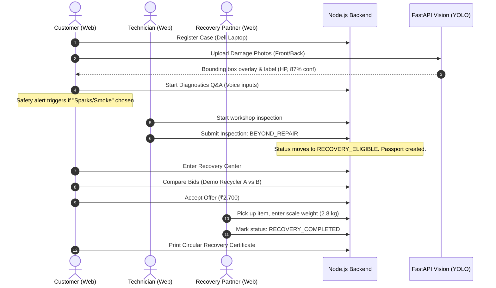

# ♻️ RepairConnect: The Universal Circular Economy & Intelligent Diagnostics Suite

> **"Urban Company starts when the customer knows what service they need. RepairConnect starts when they don't."**

RepairConnect is a production-quality, enterprise-grade lifecycle platform designed to solve the global household discard crisis. It prevents everyday items—electronics, furniture, mechanical tools, home appliances, and vehicles—from being blindly dumped into landfills by guiding users through an intelligent diagnostic pipeline, a strict technician gatekeeper review, and a certified circular recovery marketplace.

---

## 📖 Table of Contents
1. [The Discard Crisis & Our Mission](#-the-discard-crisis--our-mission)
2. [Deep Dive: The 8 "Wow" Features](#-deep-dive-the-8-wow-features)
   - [Visual AI & OCR Inspection](#1-visual-ai--ocr-inspection-live-yolov11)
   - [Voice-Activated Diagnostics & Safety Gate](#2-voice-activated-diagnostics--safety-gate)
   - [Technician Gatekeeper Audit](#3-technician-gatekeeper-audit)
   - [Circularity Hierarchy Visualizer](#4-circularity-hierarchy-visualizer)
   - [Market Valuation & Bidding Engine](#5-market-valuation--bidding-engine)
   - [Timeline-Based Product Passport](#6-timeline-based-product-passport)
   - [Circularity Diverted Weight Dashboard](#7-circularity-diverted-weight-dashboard)
   - [Green Recovery Certificates](#8-green-recovery-certificates)
3. [Controlled State Machine](#-controlled-state-machine)
4. [Backend Schema & Architecture Design](#-backend-schema--architecture-design)
5. [Complete Source Code Directory Mapping](#-complete-source-code-directory-mapping)
6. [Hackathon Demo Scenario walkthrough](#-hackathon-demo-scenario-walkthrough)
7. [Installation & Local Run Guide](#-installation--local-run-guide)

---

## 📌 The Discard Crisis & Our Mission

### The Problem
When household items break down, consumers face severe **information asymmetry**. They do not know:
* If the item is physically salvageable.
* If individual components (like a laptop SSD or an AC fan motor) are reusable.
* If the item contains recoverable metals (copper, aluminium) that have real salvage value.
As a result, items are either dumped in trash bins or sold to local scrap dealers for arbitrary, undervalued cash, leading to severe resource loss and environmental degradation.

### The Mission
RepairConnect introduces an **evidence-based circular pathway**. We maximize product lifetime through structured decisions, ensuring that when an item genuinely cannot be repaired, its components and raw materials are harvested by verified recovery partners.

---

## 💎 Deep Dive: The 8 "Wow" Features

### 1. Visual AI & OCR Inspection (Live YOLOv11)
* **What it does**: Allows users to upload three distinct angles of their damaged item (Front, Back/Ports, and Damage Close-up).
* **The Tech**: 
  * Integrates with a local **FastAPI Visual Server** running Python 3.10+ in the `D:/Computer_Vision/venv` virtual environment.
  * **Real-time YOLOv11 Detection**: Parses the image to locate products and key external sub-assemblies (e.g., keyboards, screens, motors, compressor vents).
  * **OpenCV Quality Filter**: Measures image sharpness using Laplacian variance ($\sigma^2 < 50$ throws a blur warning) and brightness averages ($30 < \mu < 240$) to prevent poor-quality inputs from corrupting data.
  * **Pytesseract OCR**: Scans product label stickers to extract brand names (HP, LG, Samsung) and filter out serial numbers to protect privacy.
* **Wow Factor**: Color-coded confidence indicators and visual bounding boxes that make the AI's "thoughts" clear to the user.

### 2. Voice-Activated Diagnostics & Safety Gate
* **What it does**: Guides the customer through an interactive symptom tree tailored to the product category (Air Conditioner, Laptop, Bicycle, etc.).
* **The Tech**:
  * **Web Speech API**: Customers can click the microphone icon and speak answers ("Yes", "No", "No power") naturally.
  * **Safety Gate Overrides**: If the user mentions fire, smoke, sparks, exposed wiring, or a burning smell, the engine triggers an **instant fullscreen Safety Gate alert**. This blocks further testing and advises the user to unplug the device and consult emergency services.
* **Wow Factor**: Hands-free operation with built-in safety rules that prioritize human well-being.

### 3. Technician Gatekeeper Audit
* **What it does**: Customers cannot bypass inspection and send items directly to the recycling market. Only a certified repair technician can route a case to "Recovery Mode".
* **The Tech**:
  * The technician reviews the device in the workshop and records a formal report choosing:
    * `REPAIRABLE` (Routes back to the normal repair timeline)
    * `BEYOND_REPAIR` / `ECONOMICALLY_IMPRACTICAL` / `CUSTOMER_DECLINED` (Unlocks the Recovery Marketplace)
  * Captures detailed notes, component status lists, and technician signatures.
* **Wow Factor**: Maintains database integrity and stops the marketplace from being flooded with repairable items.

### 4. Circularity Hierarchy Visualizer
* **What it does**: Shows a signature status checklist tracing the exact circular economy layers:
  `REPAIR` $\rightarrow$ `REUSE` $\rightarrow$ `REFURBISH` $\rightarrow$ `COMPONENT RECOVERY` $\rightarrow$ `RECYCLING` $\rightarrow$ `DISPOSAL`
* **The Tech**:
  * A React component in `RecoveryCenter.tsx` evaluates the case's current status and highlights the active pathway.
  * Renders color-coded status badges: Green (🟢 Recommended), Yellow (🟡 Evaluated), Red (❌ Not Viable), and Gray (⚪ Zero-Waste).
* **Wow Factor**: Instantly conveys the circular lifecycle hierarchy to judges and users.

### 5. Market Valuation & Bidding Engine
* **What it does**: Displays indicative material values and lets real recovery partners submit bids.
* **The Tech**:
  * **Indicative Calculations**: Uses product average weights multiplied by local scrap rates (copper, steel, aluminium) to estimate value boundaries.
  * **Insufficient Data Warning**: If weight or material composition is unknown, it prompts the user to "Get actual partner offers" instead of displaying guessed prices.
  * **Net Value Calculator**: Calculates the real value of bids: `Net Value = Offer Amount - Pickup Fee`.
  * **Warning Banner**: Highlights bids that fall below the indicative range, encouraging users to wait for better offers.
* **Wow Factor**: Complete price transparency that protects consumers from lowball offers.

### 6. Timeline-Based Product Passport
* **What it does**: Renders an immutable lifecycle ledger for each registered product.
* **The Tech**:
  * Implemented using a custom schema in `ProductPassport.ts` that tracks events (REGISTERED, DIAGNOSED, REPAIR_ATTEMPT, BEYOND_REPAIR, RECOVERY_STARTED, COMPLETED).
  * Automatically appends actors (Customer, System, Technician, Partner) and descriptions to each event.
* **Wow Factor**: Renders a beautiful visual timeline that serves as a digital product log.

### 7. Circularity Diverted Weight Dashboard
* **What it does**: A public analytics dashboard showing real, database-backed circular metrics.
* **The Tech**:
  * Aggregates completed cases to display:
    * Products Repaired
    * Products Reused/Refurbished
    * Components Salvaged
    * Diverted Landfill Weight (in kg)
  * Uses div-based charts to render pathway distributions.
* **Wow Factor**: Real dashboard metrics that display actual progress without using fake CO₂ savings.

### 8. Green Recovery Certificates
* **What it does**: Generates a downloadable certificate after recovery is completed.
* **The Tech**:
  * Recovery partners verify and input the actual weight of the collected item.
  * Generates a digital receipt listing the Case ID, brand, verified weight, and recovery pathway.
* **Wow Factor**: Provides a tangible reward for participating in the circular economy.

---

## 🔄 Controlled State Machine

Status transitions are strictly validated in both the backend controllers and database triggers:

| Source Status | Triggering Action | Destination Status | Allowed Actor |
| :--- | :--- | :--- | :--- |
| `DIAGNOSED` | Request Service | `REQUESTED` | Customer |
| `REQUESTED` | Accept Bid | `ACCEPTED` | Repair Shop |
| `ACCEPTED` | Start Inspection | `IN_REPAIR` | Repair Shop |
| `IN_REPAIR` | Mark Beyond Repair | `RECOVERY_ELIGIBLE` | Technician Only |
| `RECOVERY_ELIGIBLE` | Accept Recovery Offer | `IN_RECOVERY` | Customer |
| `IN_RECOVERY` | Complete Processing | `RECOVERY_COMPLETED` | Recovery Partner |

* **Invalid Transition Example**: Customer or AI attempts to set status directly to `RECOVERY_ELIGIBLE` without a signed `TechnicianInspection` record $\rightarrow$ **Blocked (403/400 Validation Error)**.

---

## 📁 Complete Source Code Directory Mapping

Link directly to our primary files and logic:

### Mongoose Models
* [`User.ts`](file:///d:/RepairConnect/server/src/models/User.ts) — added `RECOVERY_PARTNER` role.
* [`RepairCase.ts`](file:///d:/RepairConnect/server/src/models/RepairCase.ts) — handles new circular statuses.
* [`TechnicianInspection.ts`](file:///d:/RepairConnect/server/src/models/TechnicianInspection.ts) — gatekeeper inspection database logs.
* [`RecoveryAssessment.ts`](file:///d:/RepairConnect/server/src/models/RecoveryAssessment.ts) — stores potential streams.
* [`ProductPassport.ts`](file:///d:/RepairConnect/server/src/models/ProductPassport.ts) — records the lifecycle timeline.
* [`VisionAnalysis.ts`](file:///d:/RepairConnect/server/src/models/VisionAnalysis.ts) — holds image quality & YOLO coordinates.

### Services & Controllers
* [`DiagnosticEngine.ts`](file:///d:/RepairConnect/server/src/services/DiagnosticEngine.ts) — rule-based diagnostic trees.
* [`RecoveryEngine.ts`](file:///d:/RepairConnect/server/src/services/RecoveryEngine.ts) — pathways and valuation math.
* [`visionController.ts`](file:///d:/RepairConnect/server/src/controllers/visionController.ts) — interfaces with the FastAPI Python server.
* [`inspectionController.ts`](file:///d:/RepairConnect/server/src/controllers/inspectionController.ts) — registers technician decisions.

### Frontend Views
* [`VisionInspection.tsx`](file:///d:/RepairConnect/client/src/pages/VisionInspection.tsx) — visual inspection uploader.
* [`DiagnosticFlow.tsx`](file:///d:/RepairConnect/client/src/pages/DiagnosticFlow.tsx) — symptom trees with voice capture.
* [`RecoveryCenter.tsx`](file:///d:/RepairConnect/client/src/pages/RecoveryCenter.tsx) — checklist, pathway visual, and biddings.
* [`ProductPassport.tsx`](file:///d:/RepairConnect/client/src/pages/ProductPassport.tsx) — lifecycle logs and certificate downloads.
* [`CircularityDashboard.tsx`](file:///d:/RepairConnect/client/src/pages/CircularityDashboard.tsx) — platform statistics.

---

## 🔑 Demo Account Credentials

Use these credentials to log in and test different user roles (all accounts use the password **`password123`**):

| Role | Email | Password | Allowed Capabilities |
| :--- | :--- | :--- | :--- |
| **Customer** | `customer@example.com` | `password123` | Create repair cases, upload device photos, start diagnostics, compare offers, and view the Product Passport. |
| **Repair Technician (QuickFix)** | `quickfix@example.com` | `password123` | Inspect requests, set bids, provide pricing, and mark cases as Beyond Repair to trigger Recovery mode. |
| **Repair Technician (Express Tech)** | `repairer@example.com` | `password123` | Alternate repairer shop account. |
| **Recovery Partner (Recycler)** | `demorecycler@example.com` | `password123` | View recovery cases, submit pickup bids, update pickup status, and complete the recovery weight processing. |
| **Recovery Partner (Refurbisher)** | `demorefurbisher@example.com` | `password123` | Submit bids to refurbish products. |
| **Recovery Partner (Scrap Buyer)** | `demoscrap@example.com` | `password123` | Submit local scrap bids. |
| **Platform Admin** | `admin@example.com` | `password123` | View global circularity dashboards, audit users, and manage material rates. |

---

## 🏆 Hackathon Demo Scenario Walkthrough

Follow these steps for a complete 3-minute hackathon demonstration:



---

## ⚙️ Installation & Local Run Guide

### 1. Requirements
* **Node.js** (v18+)
* **MongoDB Atlas**
* **Python** (v3.10) with `tesseract` binary installed on system PATH.

### 2. Configure Environment variables
Set up your `.env` files in both the `server/` and `client/` folders as detailed in the root configuration templates.

### 3. Startup Commands
Open three terminal windows:

* **Terminal 1: Node.js Backend**
  ```bash
  cd server
  npm install
  npm run seed
  npm run dev
  ```

* **Terminal 2: React Frontend**
  ```bash
  cd client
  npm install
  npm run dev
  ```

* **Terminal 3: Python Vision Engine (venv)**
  ```bash
  cd D:\Computer_Vision
  # Run the FastAPI server directly using the virtual environment python
  D:\Computer_Vision\venv\Scripts\python.exe D:\Computer_Vision\vision_service.py
  ```

---

## 🌐 Production Cloud Deployment Guide

Follow this guide to deploy the full platform to production.

### 1. Deploying Backend (Render)
Create a new **Web Service** on Render connected to your GitHub repository:
* **Root Directory**: `server`
* **Build Command**: `npm install && npm run build`
* **Start Command**: `node dist/index.js`
* **Environment Variables**:
  * `MONGODB_URI` = `mongodb+srv://<db_user>:<db_password>@cluster0.wbehmva.mongodb.net/repairconnect`
  * `JWT_SECRET` = `RepairConnectSecureSecretKey2026!`
  * `CLIENT_URL` = `https://repair-connect-nine.vercel.app` *(Your Vercel frontend URL)*
  * `AI_API_KEY` = `not_needed_for_demo`
  * `AI_MODEL` = `gemini-1.5-flash`
  * `DEMO_MODE` = `true`

### 2. Deploying Frontend (Vercel)
Create a new **Project** on Vercel:
* **Root Directory**: `client`
* **Framework Preset**: `Vite` (automatically detected)
* **Environment Variables**:
  * `VITE_API_URL` = `https://repairconnect.onrender.com/api` *(Your Render backend URL)*

### 3. Database Security Setup (MongoDB Atlas)
* In the Atlas dashboard, navigate to **`Security Quickstart`** in the left sidebar.
* Under the **IP Access List** section, add `0.0.0.0/0` (Allow Access from Anywhere) to authorize incoming connections from Render's dynamic IP servers.
* Click **Finish and Close** to apply the configuration.

